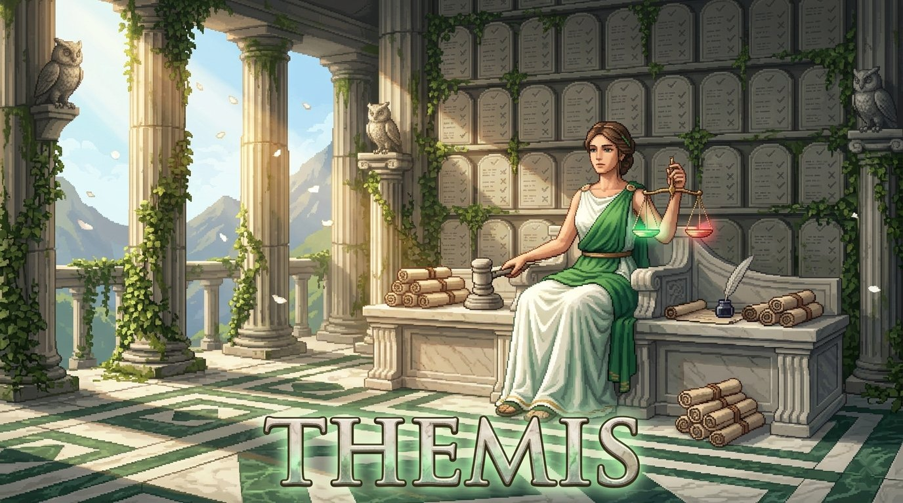

<p align="center">
  
</p>

<h1 align="center">Themis</h1>

<p align="center">
  <strong>Testing and Validation Titan for Code and AI Agents</strong><br>
  47 test strategies, 45 decision rules, 12 agent testing patterns, and six comparison engines. She tells you what to test, why, and whether it passed.
</p>

<p align="center">
  <a href="LICENSE"></a>
  <a href="https://www.python.org/downloads/"></a>
  <a href="https://modelcontextprotocol.io"></a>
  <a href="https://ko-fi.com/rezraa"></a>
</p>

---

## Why

Most testing tools tell you how to run tests. Themis tells you what to test and why.

She carries a structured knowledge base of testing strategies, decision rules that map problem signals to the right approach, and framework comparisons so she can recommend the right tool for the job. You describe the shape of what you are building. She matches it to the right testing strategy.

What makes her different is agent testing. She has 12 deep patterns specifically for testing agentic AI flows. Prompt regression, tool call validation, multi turn consistency, hallucination detection, token budget enforcement, safety guardrails, and more. She connects to agents through pluggable adapters and judges their output with six comparison engines. She does not just say pass or fail. She scores, she explains deviations, she tells you exactly where the output diverged and why.

Named after the Titan of divine law and natural order. She judges what is correct and what is wrong. No opinion, just truth.

## Knowledge Base

Structured testing knowledge, not vibes.

| Category | Count | What |
|----------|-------|------|
| Test strategies | 47 | Unit, integration, end to end, contract, property based, mutation, snapshot, load, security, accessibility, visual regression, API, and agent testing. Each with signals, complexity ratings, compatible frameworks, trade offs. |
| Decision rules | 45 | Signal to strategy mappings. "Testing isolated function logic with known inputs" maps to parameterized unit tests. "Multi turn conversation with context retention" maps to consistency testing. |
| Frameworks | 17 | pytest, jest, vitest, playwright, cypress, selenium, k6, locust, artillery, OWASP ZAP, axe, Percy, Pact, Hypothesis, DeepEval, Promptfoo, Giskard. Each tagged with agent testing support level. |
| Agent patterns | 12 | Prompt regression, tool call validation, multi turn consistency, hallucination detection, determinism, token budget, safety boundaries, agent chain integrity, stream validation, latency profiling, context window management, grounding accuracy. |

13 strategy categories. 9 test coverage categories. Six comparison engines for judgment.

## Tools

| Tool | What it does |
|------|-------------|
| `plan_test_strategy` | Takes a system description and structural signals, matches them against decision rules, filters by constraints like language or complexity, returns recommended strategies with framework suggestions. Detects agent signals automatically. |
| `judge_output` | Core judgment engine. Given expected and actual output, runs comparison strategies and returns a verdict (pass, fail, warning), a score from 0 to 1, specific deviations, tool call analysis, and token usage analysis. |
| `run_agent_test` | Executes test cases against a live agent using the adapter system. Connects, sends prompts, collects responses, judges them, returns detailed results with timing and token usage. |
| `evaluate_coverage` | Analyzes your existing tests against what Themis recommends. Finds gaps, identifies risk areas, suggests specific tests to add. |
| `log_verdict` | Records test results. Standalone: local JSON log. Inside Othrys: writes to the shared graph as memories with type "test_verdict". |

## Comparison Engines

Six ways to judge output:

| Engine | How it works |
|--------|-------------|
| Exact match | String level equality check |
| Contains | Verifies required substrings are present |
| Token similarity | Jaccard style token overlap ratio |
| JSON structure | Validates JSON shape without comparing values |
| Regex | Pattern matching with case sensitivity options |
| Tool calls | Validates tool call sequences and arguments |

Scores from 0 to 1. Pass at 0.95 or above, warning between 0.6 and 0.95, fail below 0.6.

## Adapters

Themis tests agents through four pluggable adapters:

| Adapter | What it connects to |
|---------|-------------------|
| WebSocket | MCP servers using JSON RPC. Tracks tool calls, measures latency, handles reconnection. |
| HTTP | REST API agents. Supports single response and streaming (SSE) modes. Extracts token counts from headers. |
| Stdio | CLI agents via subprocess. Sends prompts through stdin, reads stdout, captures stderr, kills on timeout. Good for Claude Code agents and local scripts. |
| Stream | Server Sent Events endpoints. Validates chunk ordering, measures time to first token, handles stream drops. |

The adapter registry supports aliases (ws, rest, sse, subprocess) and can be extended at runtime with custom adapters.

## Quick Start

### Install

```bash
git clone https://github.com/rezraa/themis.git
cd themis
python3 -m venv .venv && source .venv/bin/activate
pip install -e ".[dev]"
```

### Run Tests

```bash
pytest
# 59 tests, all passing
```

### Configure with Claude Code

Add to your project's `.mcp.json`:

```json
{
  "mcpServers": {
    "themis": {
      "command": "/path/to/themis/.venv/bin/python3",
      "args": ["-m", "themis.server"],
      "cwd": "/path/to/themis",
      "env": {
        "PYTHONPATH": "src"
      }
    }
  }
}
```

Then in Claude Code:

```
/judge review our test coverage and tell me what we are missing
```

### Dashboard

```bash
./start.sh
# Open http://127.0.0.1:8200
```

Dark theme testing dashboard. Results appear as cards in real time, color coded by verdict: green for pass, red for fail, amber for warning. Three pure Canvas charts: latency sparkline for the last 50 tests, donut chart for verdict distribution, bar chart for token usage. Click any result to expand a diff viewer that highlights differences at the word level.

## Architecture

```
Claude Code (top level LLM) -> invokes /judge agent
  +-- Themis Agent (reasoning via persona + skill instructions)
       +-- Themis MCP Tools (plan, judge, run, evaluate, log)
            +-- Knowledge Base (JSON)
            |    |-- test_strategies.json (47 strategies)
            |    |-- decision_rules.json (45 rules)
            |    |-- agent_patterns.json (12 patterns)
            |    +-- frameworks.json (17 frameworks)
            +-- Adapter System
                 |-- WebSocket
                 |-- HTTP
                 |-- Stdio
                 +-- Stream
```

Dual mode: all tools accept an optional `conn` parameter. Without it, Themis runs standalone on local JSON. With it (inside Othrys), she reads from and writes to the shared Kuzu graph. Same logic, richer data.

## Project Structure

```
themis/
+-- src/themis/
|   |-- server.py              # MCP server
|   |-- adapters/
|   |   |-- base.py            # Base adapter classes
|   |   |-- http.py            # HTTP/REST adapter
|   |   |-- websocket.py       # WebSocket/MCP adapter
|   |   |-- stdio.py           # CLI subprocess adapter
|   |   |-- stream.py          # SSE adapter
|   |   +-- registry.py        # Adapter factory
|   |-- tools/
|   |   |-- plan_test_strategy.py   # Strategy planning
|   |   |-- judge_output.py         # Judgment engine
|   |   |-- run_agent_test.py       # Agent test runner
|   |   |-- evaluate_coverage.py    # Coverage analysis
|   |   +-- log_verdict.py          # Verdict recorder
|   |-- knowledge/
|   |   |-- test_strategies.json
|   |   |-- decision_rules.json
|   |   |-- agent_patterns.json
|   |   +-- frameworks.json
|   +-- dashboard/             # Real time testing monitor
+-- .claude/
|   |-- agents/themis.md       # Agent persona
|   +-- skills/judge/          # Skill workflow
+-- tests/                     # 59 tests
+-- start.sh                   # Dashboard launcher
+-- pyproject.toml
```

## Part of Othrys

Themis is one of the Titans in the [Othrys](https://github.com/rezraa/othrys) summoning engine. Standalone, she plans test strategies and judges output for any project. Inside Othrys, her verdicts feed into the shared graph and her recommendations connect to architecture decisions (Coeus), security findings (Hyperion), and project history (Phoebe).

## Support

If Themis is useful to your work, consider [buying me a coffee](https://ko-fi.com/rezraa).

## Author

**Reza Malik** | [GitHub](https://github.com/rezraa) | [Ko-fi](https://ko-fi.com/rezraa)

## License

Copyright (c) 2026 Reza Malik. [Apache 2.0](LICENSE)
